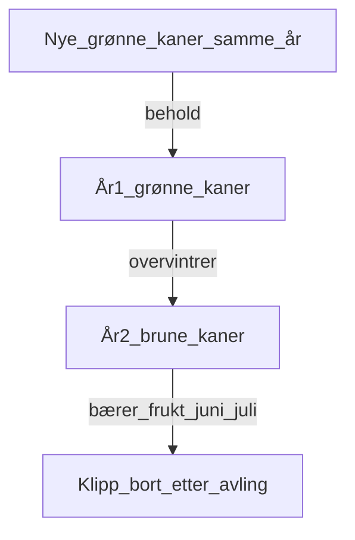

# Bringebær: Beskjæring og støtte (sommerbringebær)

Du har **sommerbringebær** og **støttetråder allerede**. Jobben er å bruke dem riktig.

## Hvordan sommerbringebær fungerer

- Avling kommer på **fjorårets** kaner (brune)
- Årets grønne kaner = neste års avling

## Støtte (du har tråd — sjekkliste)

Målhøyde for støttesystem: ca. **1,5–1,8 m**, med **2–3 tråder**.

- [ ] Sjekk at stolper står stødig
- [ ] Stram støttetrådene hvis de er slakke
- [ ] Bind inn grønne kaner jevnt langs trådene (ikke i en tett klump)
- [ ] Fjern kaner som vokser langt utenfor raden, eller bind dem inn

### Bindingstips

- Bruk myk hagesnor eller strips som ikke skjærer inn i kanen
- Bind løst nok til at kanen kan tykne litt
- Fordel kanene langs tråden for god lufting

## Beskjæring — under høsting (nå)

- [ ] Høst fra brune kaner
- [ ] Bind inn grønne kaner
- [ ] Fjern bare døde/syke kaner

## Beskjæring — etter avling (slutten av juli / august)

1. [ ] Klipp **alle brune (fruktede) kaner** helt ned til bakken
2. [ ] Behold **6–8 friske grønne kaner per løpemeter**
3. [ ] Fjern svake/tynne grønne kaner hvis det er flere enn 6–8 per meter
4. [ ] Bind de beholde kanene inn på nytt

## Vanlige feil

| Feil | Konsekvens |
|------|------------|
| Klippe grønne kaner nå | Mister neste års avling |
| La brune kaner stå etter avling | De stjeler næring og luft |
| For mange kaner per meter | Dårlig lufting, mer sykdom, mindre bær |

## Etter beskjæring

Gå videre til [05-jord-mulch.md](05-jord-mulch.md).
