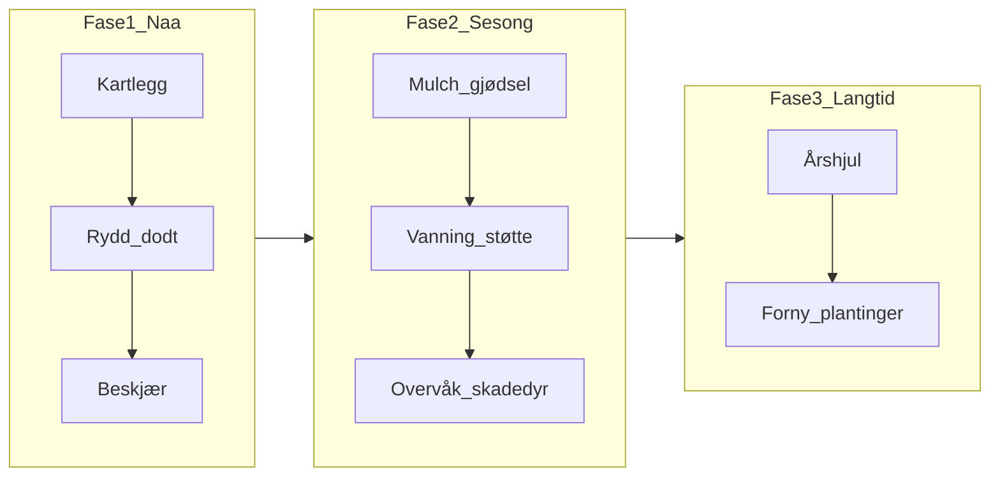

# Plan for jordbær- og bringebærlend

Praktisk vedlikeholdsplan for et lite, tidligere overvokst jordbær- og bringebærlend.
Ugresset er luket bort. Målet er god struktur, sunnere planter og jevn avling.

## Din situasjon

| Område | Status |
|--------|--------|
| **Bringebær** | Sommerbringebær. Både grønne og brune kaner. Støttetråder på plass. |
| **Jordbær** | Mange gamle planter. Noen har vokst ut av plassen sin. |

## Dokumenter

| Fil | Innhold |
|-----|---------|
| [01-kartlegging.md](01-kartlegging.md) | Status og sjekkliste for begge arealer |
| [02-opprydding.md](02-opprydding.md) | Umiddelbar rydding og tynning |
| [03-jordbaer-renovering.md](03-jordbaer-renovering.md) | Jordbærklipping og grensekontroll |
| [04-bringebaer-beskjaering-stotte.md](04-bringebaer-beskjaering-stotte.md) | Beskjæring og støtte for sommerbringebær |
| [05-jord-mulch.md](05-jord-mulch.md) | Kompost, mulch og jordpleie |
| [06-vanning-overvaaking.md](06-vanning-overvaaking.md) | Vanning, skadedyr og sykdom |
| [07-fornyelsesplan.md](07-fornyelsesplan.md) | Langsiktig fornyelse av plantingene |
| [aarshjul.md](aarshjul.md) | Årshjul for typisk norsk klima |
| [uke-sjekkliste.md](uke-sjekkliste.md) | Arbeidsrekkefølge de neste 4 ukene |

## Mål

1. Redusere tetthet og sykdomspress
2. Gjenopprette riktig beskjæring og struktur
3. Bygge jord og næring over tid
4. Få jevn, god avling neste sesong og årene etter

## Arbeidsflyt

## Forventet resultat

| Tid | Hva du kan forvente |
|-----|---------------------|
| **Resten av 2026** | Ryddigere bed. Bringebær: grønne kaner klare for neste år. Jordbær: renovert, men begrenset avling fra gamle planter. |
| **2027** | God bringebæravling. Ny jordbærrad plantet om våren gir frisk start. |
| **2028+** | Stabil avling begge steder med årlig lett vedlikehold (2–4 timer per sesong). |
