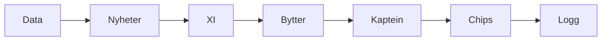

# Ukentlig prosess (før hver deadline)

Sett av **20–40 minutter** samme dag hver uke (f.eks. torsdag kveld / fredag formiddag).

## Fast rekkefølge



### 1. Data (5 min)

```bash
cd fpl/tools
python3 fpl_cli.py weekly
python3 fpl_cli.py fixtures --next 4
```

Se etter: formfall, prisrisiko, spillere med dårlig run, «hits» som faktisk er verdt −4.

### 2. Nyheter (5–10 min)

Sjekk kun pålitelige kilder (klubb, offisiell FPL, anerkjente journalister):

- Skade / suspendert / rotasjon / cup
- Presskonferanse nærmeste kamp

Hvis usikkerhet: **VC** på tryggere valg, eller bytt ut.

### 3. Sett XI (5 min)

- Beste 11 ut fra form + fixture + minutter
- Ikke start en «dyrt navn» som ikke spiller

### 4. Bytter (5–10 min)

| Situasjon | Handling |
|-----------|----------|
| Skade / 0 minutter forventet | Prioritert gratis bytte |
| Dårlig form, men OK fixture snart | Hold ofte |
| To hull, kun 1 gratis | Vurder −4 bare hvis begge bytter har klar oppside |
| Pris faller i natt | Bytt bare hvis du uansett vil ha spilleren ut |

### 5. Kaptein (3 min)

Prioritet: **minutter sikre** × **fixture** × **poenghistorikk/EP**.  
I mini-liga: avvik fra template-kaptein kun med god grunn.

### 6. Chips (2 min)

Se [04-chips-og-strategi.md](04-chips-og-strategi.md). De fleste uker: ingen chip.

### 7. Logg (2 min)

Noter kort i `beslutningslogg.md` (opprett ved behov):

- Bytter inn/ut
- Kaptein
- Hvorfor (1 setning)
- Resultat neste uke (poeng vs snitt)

Dette er gull når du evaluerer midt i sesongen.
