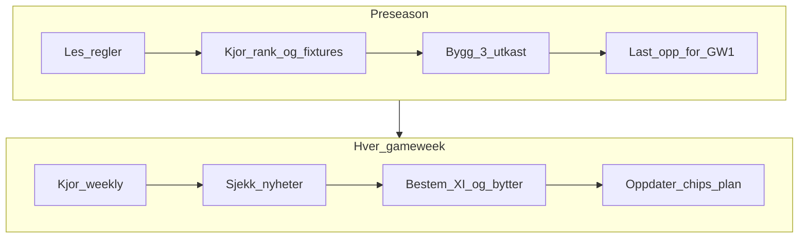

# FPL 2026/27 — konkurranseprosess

Prosess + dataverktøy for å bygge et sterkt startlag og ta gode beslutninger hver gameweek i mini-ligaen.

**Sesong:** 2026/27  
**GW1-deadline:** fredag 21. august 2026, 18:30 norsk tid  
**Budsjett:** £100m · 15 spillere · maks 3 per klubb

## Anbefalt valg

For liga-konkurranse med godt beslutningsgrunnlag: **prosess + data**.

| Del | Hvorfor |
|-----|---------|
| **Prosess** | Samme sjekkliste hver uke → færre impulsive bytter, bedre chips-timing |
| **Dataverktøy** | Tall bak valgene (EP, fixtures, eierskap, verdi) → bedre enn magefølelse alene |

## Dokumenter

| Fil | Innhold |
|-----|---------|
| [01-regler-og-mal.md](01-regler-og-mal.md) | Regler, poeng og målene dine |
| [02-preseason-lagbygging.md](02-preseason-lagbygging.md) | Hvordan bygge startlaget før GW1 |
| [03-ukentlig-prosess.md](03-ukentlig-prosess.md) | Fast rutine før hver deadline |
| [04-chips-og-strategi.md](04-chips-og-strategi.md) | Wildcard, Free Hit, Bench Boost, Triple Captain |
| [05-mini-liga.md](05-mini-liga.md) | Differensialer og liga-taktikk |
| [sesongkalender.md](sesongkalender.md) | Grovmål for chips og milepæler |
| [uke-sjekkliste.md](uke-sjekkliste.md) | Kopiérbar sjekkliste før deadline |
| [tools/](tools/) | Python-verktøy mot offisiell FPL API |

## Arbeidsflyt



## Kom i gang (5 minutter)

```bash
cd fpl/tools
python3 fpl_cli.py rank --top 15
python3 fpl_cli.py fixtures --next 6
python3 fpl_cli.py draft
python3 fpl_cli.py weekly
```

Ingen ekstra pakker kreves (kun Python 3 + nett).

## Beslutningsprinsipper (kort)

1. **Fixtures først** — gode kamper de neste 4–6 GW er viktigere enn «navn».
2. **Verdi over stjerner** — £-per-poeng og billige starters frigjør midler til premium.
3. **Én plan, få bytter** — bruk gratis bytter; unngå −4 med mindre oppsiden er tydelig.
4. **Mini-liga krever differensialer** — noen ikke-template-valg (typisk 5–15 % eierskap).
5. **Chips er sesongressurser** — planlegg dem; ikke bruk panikk-wildcard i uke 3.
